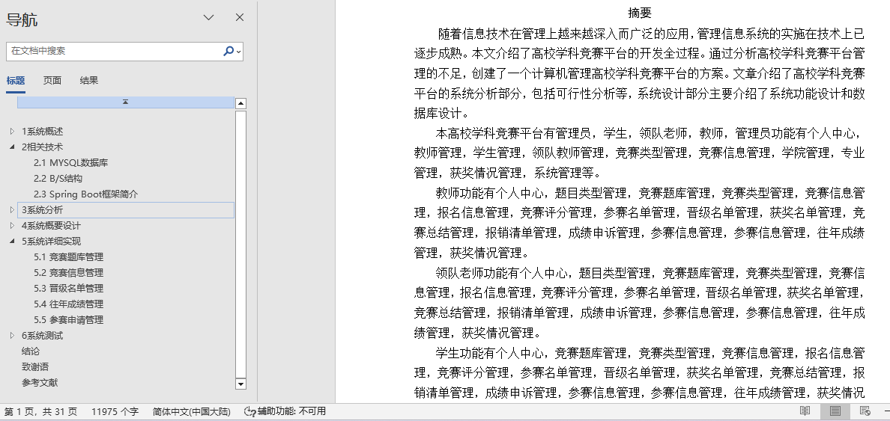
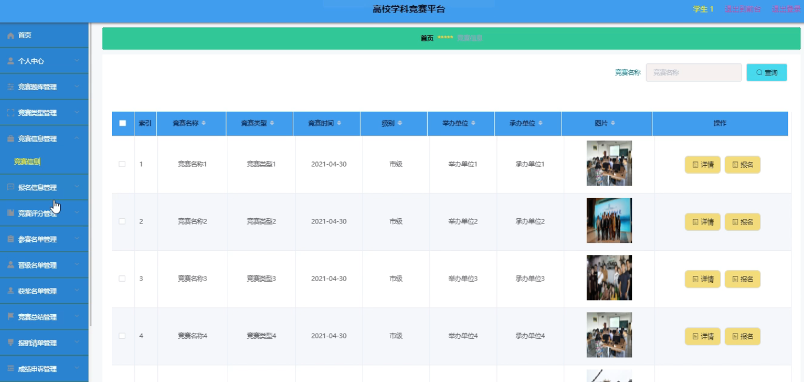
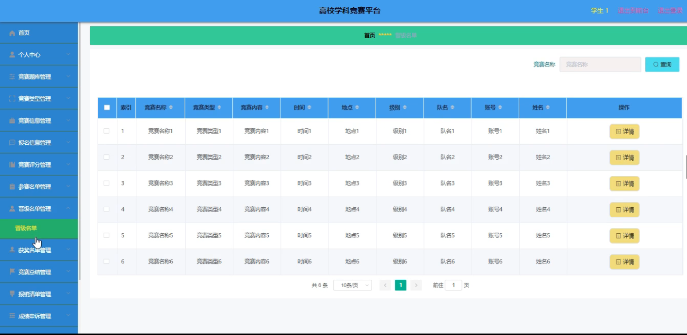
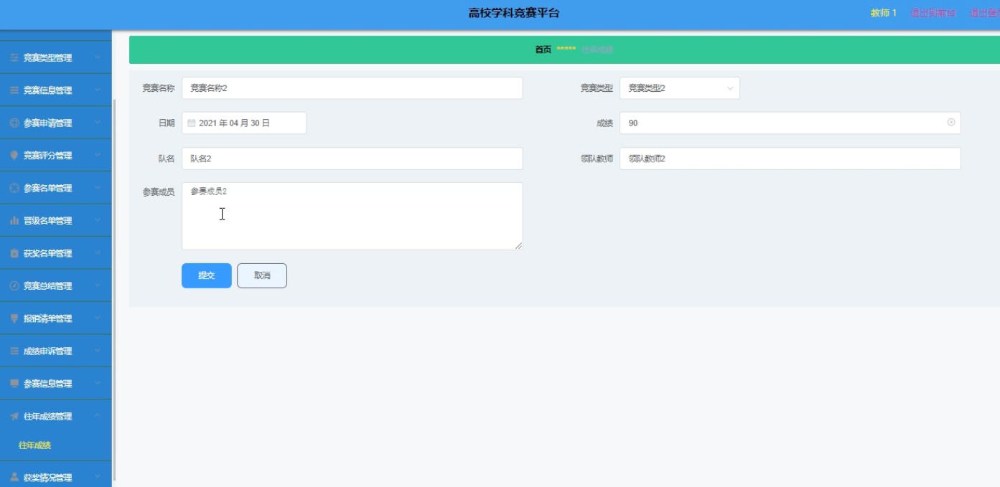
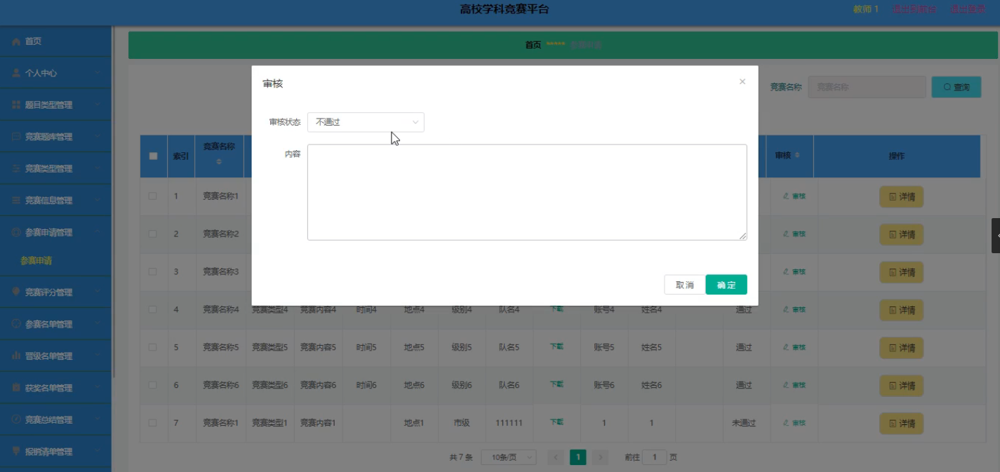
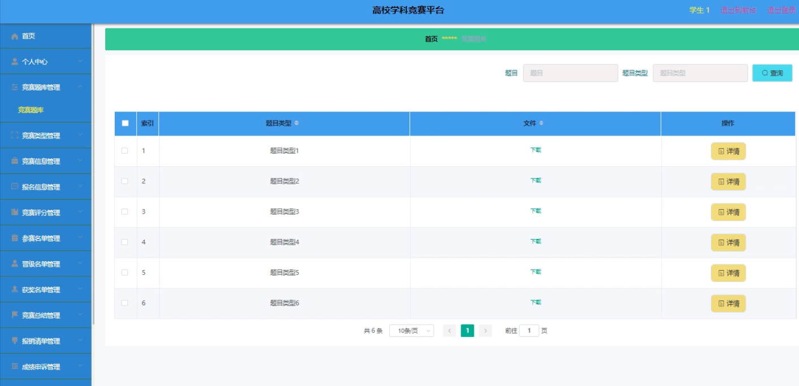

## 基于SpringBoot的高校学科竞赛平台(程序+报告)

###  获取sql数据库文件: 从戎源码网 (https://armycodes.com/) QQ: 386869957 QQ群: 377586148
###  所有系统地址: (https://github.com/YuLin-Coder/AllProjectCatalog) 
###  所有项目以及源代码本人均调试运行无问题 可支持远程安装部署调试、定制修改、代码讲解

## 项目介绍
基于SpringBoot的高校学科竞赛平台，系统包含两种角色：用户、管理员，系统分为前台和后台两大模块，主要功能如下：

1 竞赛题库管理
- 竞赛题库管理: 系统管理员可以对竞赛题库进行全面管理，包括添加、修改、删除及查询竞赛题库信息。

2 竞赛信息管理
- 竞赛信息管理: 系统管理员可以查看和管理竞赛信息，包括添加、修改、删除及查询操作。

3 晋级名单管理
- 晋级名单管理: 管理员可以对晋级名单进行修改、删除和查询操作，以确保晋级信息的准确性。

4 往年成绩管理
- 往年成绩管理: 教师可以对往年竞赛成绩进行修改和查询，确保成绩数据的更新和准确。

5 参赛申请管理
- 参赛申请管理: 教师可以审核学生提交的参赛申请，以确认其参赛资格和信息。

## 项目技术
- 编程语言：Java
- 数据库：MySQL
- 项目管理工具：Maven
- 前端技术：HTML、CSS、JavaScript、Jquery、Vue
- 后端技术：Spring、SpringMVC、MyBatis

## 运行环境
- JDK版本：JDK1.8及以上
- 开发工具：IDEA、Ecplise、Myecplise都可以
- 数据库: MySQL5.7及以上
- Maven：maven3.0及以上
- Node：14.14.0及以上

## 运行截图

